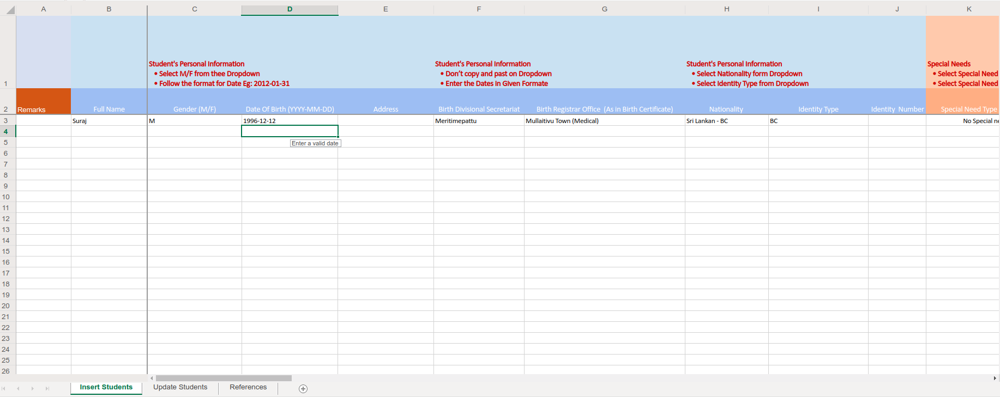
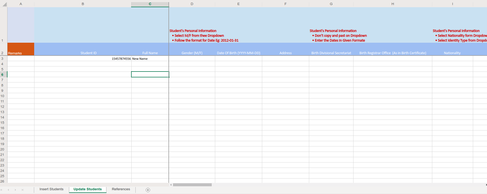

Bulk Data Upload

Bulk data upload feature will facilitate end-users to import new students details using an Excel sheet. The Upload process could be done by the Class teacher as they should upload data of particular class students details. Bulk Upload excel sheet contains the following data with it.

The bulk upload App will be a simple app which user can login using there NEMIS-SIS login information and download template what we have designed already.  We can track 

## Student information
 
  * Full name
  * Gender
  * Date of Birth
  * Address 
  * Birth registrar Office
  * Nationality
  * Nationality Type
  * Identity  Number
## BMI

  * Height
  * Weight
  * Date
  
## Academic Information
 
 * Admission No
 * Academic Period
 * Education Grade
 * Start Date

## Special Needs
 
 * Need Type
 * Special Need Difficulty

## Optional Subject
  
  *Options 1 to n

## Guardian's Information

### Father
  * Full name
  * Date of Birth
  * Address
  * Address Area
  * Nationality
  * Identity Type
  * Identity Number

### Mother

  * Full name
  * Date of Birth
  * Address
  * Address Area
  * Nationality
  * Identity Type
  * Identity Numbe
  
### Guardian
  
  * Full name
  * Date of Birth
  * Address
  * Address Area
  * Nationality
  * Identity Type
  * Identity Number

Here we are Processing Many tables to import data. To simplify the process.

We are support for fresh data import and update exsisting data.You can find the template from here.

[Template](https://onedrive.live.com/download?resid=367F7CD71188D7DA%211012&authkey=%21AL4A-jLv8V-fhEI&em=2&wdAllowInteractivity=False&wdHideGridlines=True&wdHideHeaders=True&wdDownloadButton=True&wdInConfigurator=True)

We can upload new by filling this sheet and upload to the system

We can update exsiting student's data by uploading this sheet.

