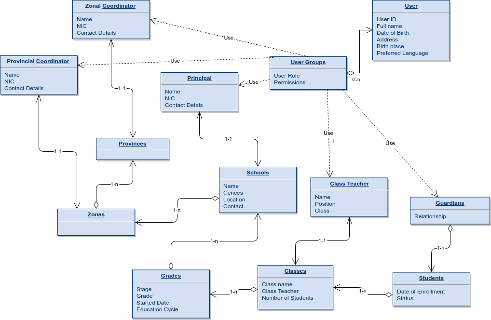

# Information Schema

## User:
The system has many types of users, Users may use the system or may not exist in the system. Users will have the following information with them.

## User Roles:
User roles will be assigned to every user. Based on the Roels they will get access for modules and data in the system. The System has the following Roles already.
  * MoE Admin
  * Provincial Coordinator / National Schools coordinator
  * Zonal Coordinator
  * School Coordinator
  * Class Teacher
  * Student
  * Guardians
  
## Provinces:
Its collections of administrative provinces of the country in the Education system,  Each province will have Provincial coordinator. They are accountable for All information under provinces.

## Zones:
Its collections of administrative zones of the country in the Education system,  Each zone will have Zonal coordinator. They are accountable for All information under zones.

## Schools:
Main entity of the system which is the first point which is most of the transactions are being done. School coordinator responsible for this entity and it contains all of the basic information of schools.
  * Name of the school
  * Education Zone belongs to
  * Census No
  * Address
  * Geographical Location (Latitude & Longitude)
  * Contact Person

Schools have many sub-entities with relating to the National Education system as follows.
  * Grades 
  * Class Rooms
  * Teachers / Class Teachers
  * Students
  * Guardians

